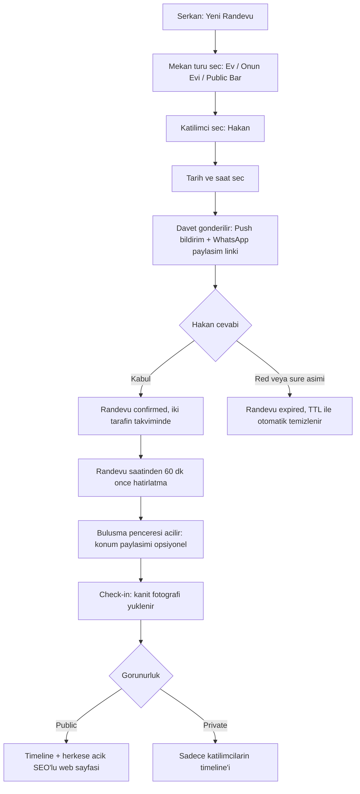
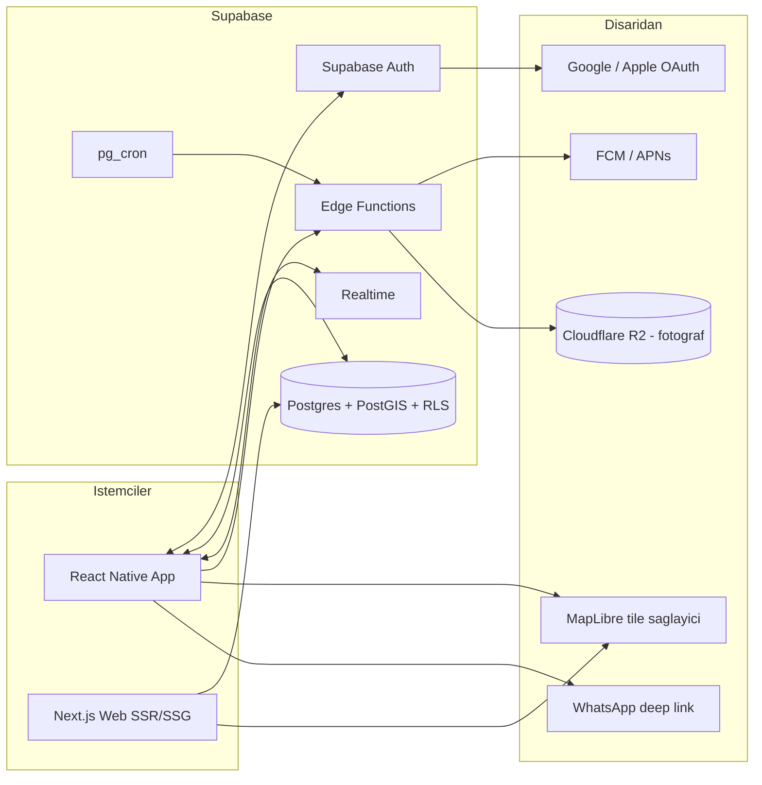

# Beer Together — Mimari & Ürün Dokümanı

Sep 18, 2026 · Hazırlayan: @SERKAN

## 1. Vizyon & Konsept

**Beer Together**, arkadaşların gerçek hayatta bira içmek için buluşmasını bir "randevu" nesnesi etrafında planlayan, dating app'lerin taahhüt/commitment mekaniğini arkadaşlık eksenine taşıyan bir mobil platformdur. Yabancı eşleştirme yoktur; mevcut arkadaşlık grafiğini (rehber/sosyal bağlantı) kullanır.

**Hedef kullanıcı:** 21-40 yaş arası, şehirli, arkadaş çevresiyle düzenli fiziksel buluşma isteyen ama WhatsApp gruplarında "ne zaman buluşsak" mesajının kaybolduğu kişiler.

**Neden şimdi:** Mesajlaşma uygulamaları niyeti ("bira içelim") bir taahhüde çevirmiyor — mesaj kaybolur, kimse cevap vermez, plan ölür. Beer Together niyeti somut bir randevu nesnesine (tarih, saat, mekan, katılımcı, durum) çevirir ve bunu bildirim + kanıt fotoğrafı ile güçlendirir.

**Çekirdek döngü:** Randevu oluştur → Arkadaş davet et → Kabul/red → Hatırlatma bildirimi → Buluşma & check-in → Kanıt fotoğrafı → Timeline'da paylaşım (herkese açık ise ayrıca genel web'de SEO'lu sayfa).

**MVP kapsamı dışı (bilinçli non-goal'lar):**

- Uygulama içi mesajlaşma/DM yok — tek tıkla WhatsApp'a geçiş var.
- Yabancılarla eşleştirme yok — bu bir dating/keşfet app'i değil, mevcut arkadaşlık ağını organize eden bir araç.
- Sürekli/arka planda canlı konum takibi yok — konum paylaşımı sadece randevu penceresinde ve kullanıcının açık onayıyla devrededir (bkz. Bölüm 10).

Bu doküman boyunca ürünün adı **Beer Together** olarak geçecek; "Drink Beer With Me" ve "PintPals" marka alternatifi olarak Bölüm 17'de not edilmiştir.

## 2. Temel Kullanıcı Akışları

Beşli döngü: **oluştur → davet/kabul → hatırlat → buluş/check-in → paylaş.**



**Randevu (event) durum makinesi:** `draft → pending_invite → confirmed → in_progress → completed` veya `declined` / `expired` / `cancelled`. Her geçiş backend'de atomik bir güncelleme olarak yazılır (bkz. Bölüm 9), çünkü iki kullanıcının aynı davete aynı anda cevap verme ihtimali (race condition) var.

**Davet & kabul detayı:**

- Davet, katılımcı sayısı kadar alt-kayıt (invite) üretir; her birinin kendi `status` alanı vardır (grup randevularında "3 kişiden 2'si kabul etti" gibi kısmi durumlar olur).
- Kabul etmeyen/cevapsız kalan davetler 48 saat sonra `expired` olur (TTL index, Bölüm 9).
- Davet ekranında tek tıkla "WhatsApp'ta konuş" butonu vardır; bu, `whatsapp://send?phone=...` deep link'i açar, uygulama içi mesajlaşma yerine.

**Check-in & kanıt akışı detayı:**

- Randevu saatine ±30 dakika kala "Check-in" butonu aktifleşir (öncesinde pasif — sahte check-in'i zorlaştırır).
- Check-in, GPS konumunun randevu mekanına yakınlığını (ör. 150m yarıçap) opsiyonel olarak doğrular; doğrulama başarısızsa kullanıcı yine de fotoğraf yükleyip devam edebilir (sert engelleme değil, güven sinyali).
- Kanıt fotoğrafı yüklenmeden randevu `completed` durumuna geçmez; fotoğrafsız randevular 24 saat sonra otomatik `expired_no_proof` olarak işaretlenir.

## 3. UX/UI Tasarım Prensipleri

"Apple kalitesi" somut olarak şu üç şeyi ister: **tutarlı tasarım token'ları, native hissettiren hareket/animasyon ve Apple/Google'ın kendi Human Interface Guidelines / Material 3 kurallarına gerçekten uyum** (yalnızca kopyalamak değil).

| Katman | Karar | Neden |
| --- | --- | --- |
| Bileşen kütüphanesi | Tamagui veya NativeWind + Reanimated 3 + Moti | Tailwind benzeri hız, gerçek native animasyon performansı, tek kod tabanı iOS/Android tema farkı |
| Tipografi | iOS: SF Pro (sistem fontu, ücretsiz), Android: Roboto/Inter; ikisi de Dynamic Type / erişilebilir font ölçekleme destekli | Platforma "yamalı" değil, native hissi |
| Renk sistemi | Semantic token'lar (`color.bg.primary`, `color.action.accent` vb.), light/dark mode ikisi de tasarlanır | Tek renk paleti yerine anlam bazlı token, tema değişiminde kırılmaz |
| Hareket | Sayfa geçişleri native stack navigator (react-native-screens) ile, custom JS-tabanlı geçiş yok | 60fps hissi, pil tüketimi düşük |
| İkonografi | SF Symbols tarzı tek-hat, tutarlı stroke width; Lucide veya Phosphor icon seti temel alınır | Tutarlı görsel dil |
| Erişilebilirlik | VoiceOver/TalkBack etiketleri, minimum 44x44pt dokunma alanı, kontrast oranı WCAG AA | App Store/Play Store reddi riskini düşürür |

**Tasarım süreci önerisi:** Figma'da önce bir "design system" dosyası (renk, tipografi, spacing 4pt grid, bileşen varyantları) kurulur, sonra ekranlar bu sistemden türetilir — tam tersi (önce ekran, sonra sistem) tutarsızlık üretir ve "Apple kalitesi" hissini kırar.

**Kritik ekranlar (öncelik sırası):** Onboarding (tek ekran, sürtünmesiz) → Ana akış (arkadaş listesi + "randevu oluştur" tek CTA) → Randevu detay/check-in → Timeline (Instagram benzeri grid/feed hibrit) → Profil.

**Not:** Bu doküman mimariye odaklıdır; gerçek piksel-perfect ekran tasarımları için ayrı bir Figma dosyası ve component-level çalışma gerekir — bu, kod yazmadan önce yapılması gereken ayrı bir iştir.

## 4. Sistem Mimarisi — Genel Bakış

Mimarinin can alıcı noktası aynı kalıyor: **tek bir veri/iş katmanı, iki farklı istemci** tarafından beslenir. Supabase'e geçince bu katman MongoDB Atlas + NestJS'ten **Supabase (Postgres + Auth + Storage + Realtime + Row Level Security) + gerektiğinde Supabase Edge Functions**'a dönüşür.



**Bileşenlerin sorumlulukları (güncellendi):**

- **RN App & Next.js Web:** Rolleri değişmedi (Bölüm 13-14).
- **Supabase Auth:** Google/Apple/telefon OTP sağlayıcılarını tek çatı altında toplar, aynı kişinin farklı sağlayıcılarla girişini otomatik birleştirir (identity linking).
- **Postgres + PostGIS + RLS:** Tek doğruluk kaynağı. RLS sayesinde mobil app, basit okuma/yazma işlemlerinin çoğu için **doğrudan** veritabanına (anon key ile) güvenle bağlanabilir — yetkilendirme veritabanı seviyesinde uygulanır.
- **Realtime:** Davet kabul/red durumu ve randevu penceresindeki canlı konum güncellemelerini istemcilere websocket üzerinden anlık iletir.
- **Edge Functions (Deno, sunucusuz):** RLS'in ifade edemediği çapraz-kesişen iş mantığı — push bildirim gönderimi, WhatsApp davet token'ının çözümlenmesi, FSQ OS Places senkron job'u, moderasyon API orkestrasyonu.
- **pg\_cron:** Zamanlanmış işleri (hatırlatma taraması, TTL temizliği) tetikler, gerektiğinde Edge Function'ı çağırır.
- **Cloudflare R2:** Fotoğraf depolama, egress ücretsiz (Supabase Storage'a göre MVP'de daha ucuz kalır — bkz. Bölüm 15).

## 5. Backend Neden Şart? ("MongoDB + RN, backend'siz olur mu?")

Kısa cevap: **Hayır, olmaz.** "MongoDB + React Native, backend olmadan" fikri, mobil istemcinin veritabanına doğrudan bağlanması demektir — bu senaryoda yedi ayrı gerçek engel var:

1. **Gizli anahtar güvenliği:** Supabase'in **anon key**'i istemciye gömülebilir çünkü yetkilendirmeyi RLS politikaları üstlenir — ama **service role key** (RLS'i atlayan yönetici anahtarı) asla istemciye gömülmez; sadece Edge Functions/sunucu tarafı kullanır. Bu ayrımı karıştırmak tüm veritabanını açığa çıkarır.
2. **SEO gereksinimi senin kendi isteğin:** Google'ın bir sayfayı indexlemesi için sunucu tarafında render edilmiş HTML gerekir. React Native bunu üretmez — bu yüzden Next.js katmanı hâlâ şart.
3. **Push bildirim zamanlaması:** "Randevudan 1 saat önce hatırlat" gibi bir iş, kullanıcı telefonu kapalıyken bile tetiklenmeli. Bu artık NestJS/BullMQ değil, Supabase'in **pg\_cron**'u + bir **Edge Function** ile çalışır — ama hâlâ sürekli çalışan bir sunucu tarafı bileşen gerektirir.
4. **Karmaşık iş mantığı:** RLS "bu satırı kim okuyabilir/yazabilir" sorusunu iyi çözer ama "davet kabul edildiğinde WhatsApp token'ını çöz, push gönder, timeline'a yaz" gibi çok adımlı bir akışı çözmez — bunun için Postgres fonksiyonu/trigger'ı veya Edge Function gerekir.
5. **Kötüye kullanım/hız sınırlama:** RLS satır seviyesinde yetkilendirir ama istek hızını (rate limit) sınırlamaz; bu Edge Function önünde ayrıca ele alınmalı.
6. **Uygulama mağazası zorunlulukları:** Hesap silme uç noktası ve gizlilik politikası hâlâ gerekli; Supabase'de bu bir Edge Function/Postgres fonksiyonu olarak yazılır.
7. **Race condition'lar:** Postgres'in ACID transaction'ları (MongoDB'nin `findOneAndUpdate`'ine göre burada daha doğal ve güçlü) davet kabul/red gibi eşzamanlı güncellemeleri güvenle çözer.

**Sonuç (güncellendi):** Supabase'e geçmek backend'i tamamen ortadan kaldırmaz, onu küçültür ve yeniden şekillendirir. Basit CRUD işlemleri artık RLS korumasıyla istemciden doğrudan yapılabilir; ama zamanlama, çok adımlı iş akışları ve dış servis orkestrasyonu için hâlâ bir sunucu tarafı katman (Edge Functions, gerekirse ek bir hafif Node servisi) gerekir. Mimari üç parçalı kalıyor: **RN app (istemci)**, **Supabase (veri/auth/realtime/RLS + Edge Functions ile iş mantığı)**, **Next.js web (SEO istemcisi)**.

## 6. Teknoloji Yığını

| Katman | Seçim | Neden |
| --- | --- | --- |
| Mobil | React Native + Expo (EAS Build) | Tek kod tabanı, OTA güncelleme, native modül gerektiğinde "eject" imkanı |
| Web (SEO) | Next.js (App Router, SSR/SSG) | Google'ın indexleyebildiği sunucu render |
| Monorepo | Turborepo/pnpm workspaces | Mobil, web, Edge Functions arasında paylaşılan TypeScript tip/DTO tanımları |
| Veritabanı + Auth + Realtime | **Supabase** (Postgres + PostGIS + Auth + Realtime + Row Level Security) | Tek platformda kimlik doğrulama, ilişkisel+coğrafi veri, gerçek zamanlı güncelleme, satır seviyeli yetkilendirme; açık kaynak, kendi sunucunda da barındırılabilir (vendor lock-in azalır) |
| İş mantığı / orkestrasyon | Supabase Edge Functions (Deno) | Push gönderimi, WhatsApp token çözümü, FSQ senkronu gibi RLS'in çözemediği adımlar; ayrı bir Node.js sunucusuna göre sıfır DevOps |
| Zamanlanmış işler | Supabase pg\_cron | Hatırlatma taraması ve TTL temizliği veritabanının içinde, ek bir Redis/BullMQ altyapısı olmadan |
| Nesne depolama (fotoğraf) | Cloudflare R2 | Egress ücretsiz; foto-yoğun bir app'te Supabase Storage'a göre daha ucuz kalır |
| Push bildirim | Expo Push Notifications | FCM+APNs'i tek API arkasında sarmalar |
| Harita render | MapLibre GL Native + MapLibre GL JS | Açık kaynak, vendor lock-in yok (Bölüm 8) |
| Kimlik doğrulama | Supabase Auth — Google + Apple + Telefon OTP | Bölüm 7 |
| Deploy — backend/Edge Functions | Supabase Cloud (yönetilen) | Ayrı Render/Railway sunucusu gerekmez; Supabase CLI ile deploy |
| Deploy — web | Vercel (free tier) | Next.js için birinci sınıf destek |
| Deploy — mobil | EAS Build + Submit | App Store/Play Store'a CI/CD |
| İzleme | Sentry (free tier) | Ücretsiz kotada MVP'ye yeter |

**Not — "tamamen ücretsiz" gerçekliği (güncellendi):** Supabase'in ücretsiz katmanı 500MB Postgres depolama, 50.000 aylık aktif kullanıcı (Auth), 1GB dosya depolama ve 5GB egress sunar — ancak **7 gün trafik olmazsa proje otomatik duraklar** (Pro plana, $25/ay, geçince bu kalkar). Düşük trafikli MVP/beta için gerçekten ücretsizdir; gerçek büyümede Pro'ya geçiş bir sonraki fazın işidir (Bölüm 15).

## 7. Kimlik Doğrulama & Sosyal Girişler

**MVP için karar: Google + Sign in with Apple + telefon numarası OTP. Twitter/X ve Instagram MVP kapsamı dışı.** Gerekçe, sağlayıcı bazında:

| Sağlayıcı | Durum (2026) | Karar |
| --- | --- | --- |
| Google OAuth | Ücretsiz, standart, sorunsuz | **Kullan** — birincil giriş |
| Sign in with Apple | Ücretsiz | **Kullan — ve zorunlu.** Apple'ın App Store İnceleme Kuralı 4.8, üçüncü taraf sosyal girişi (Google gibi) sunan her app'in eşdeğer bir "Sign in with Apple" seçeneği de sunmasını şart koşar; Google'ı Apple'sız eklemek App Store'dan reddedilme riski taşır. |
| Telefon OTP | Twilio/Firebase Auth ile düşük maliyetli | **Kullan** — arkadaşlık grafiği rehber numarasına dayandığı için (Bölüm 2'deki "arkadaş seç" akışı), telefon numarası zaten kimliğin doğal bir parçası |
| X (Twitter) OAuth | Salt kimlik doğrulama ("Sign in with X") teknik olarak hâlâ ücretsizdir, ancak X'in veri API'si 2023'ten sonra ücretli katmanlara geçti ($200-$5.000+/ay) ve ücretsiz katmanda bile sıkı hız sınırları var; platformun kararlılığı/politikası sık değişiyor. | **MVP'de atla.** Sadece giriş için bile X Developer hesabı onayı ve kırılgan bir bağımlılık gerektiriyor; getirisi (X kullanıcı tabanının bu app'in hedef kitlesiyle örtüşme oranı) düşük. |
| Instagram | Instagram Basic Display API (kişisel hesap girişi için kullanılan API) Aralık 2024'te tamamen kapatıldı. Yerine gelen "Instagram API with Instagram Login" işletme/içerik odaklı bir akış ve karmaşık bir uygulama incelemesi gerektiriyor; sıradan bir "kişisel hesapla giriş yap" deneyimi sunmuyor. | **MVP'de atla.** Basit bir sosyal giriş seçeneği olarak artık pratik değil. |

**Uygulama detayı (güncellendi):** Google, Apple ve telefon OTP, Supabase Auth'un içinde hazır sağlayıcılar olarak yapılandırılır — ayrı bir OAuth kod katmanı yazmaya gerek kalmaz. Supabase Auth'un **identity linking** özelliği, aynı e-posta/telefonla giriş yapan farklı sağlayıcıları otomatik olarak tek bir kullanıcıya bağlar; `auth.users` tablosu tek doğruluk kaynağıdır, uygulamanın kendi `profiles` tablosu (username, avatar, arkadaş listesi gibi ek alanlar için) buna `user_id` ile bağlanır.

## 8. Harita & Mekan Verisi (Google Maps'siz Çözüm)

Bu soruyu ikiye ayırmak lazım: **haritayı görsel olarak çizmek** (tile/render) ve **mekan verisini (bar/pub listesi) elde etmek** (data). İkisi farklı problemler ve farklı ücretsiz çözümleri var.

**A) Harita render (görsel katman):** MapLibre GL (Mapbox GL JS'in açık kaynak forku, tamamen ücretsiz ve lisans kısıtı yok) + vektör tile kaynağı olarak ya Mapbox'ın **ücretsiz katmanı** (ayda 50.000 harita yüklemesi ve 100.000 adres araması — MVP için fazlasıyla yeterli) ya da MapTiler gibi bir sağlayıcı kullanılır. Google Maps SDK'sının aksine MapLibre'de vendor lock-in yok; tile sağlayıcı değiştirilebilir.

**B) Mekan verisi ("bar nasıl listelenir"):** Burada gerçek bir kırılma yaşandı — Kasım 2024'te Foursquare, **FSQ OS Places** adlı veri setini (200'den fazla ülkede 100 milyondan fazla mekan; isim, adres, koordinat, kategori gibi 20+ öznitelik) Apache 2.0 lisansıyla ücretsiz ve ticari kullanıma açık şekilde yayınladı, ayda bir güncelleniyor. Bu, "bar/pub" kategorisindeki mekanları filtreleyip **kendi Postgres veritabanınıza** (Supabase) `venues` tablosu olarak import etmenizi sağlar. PostGIS'in `geography(Point,4326)` tipi + GIST index ile `ST_DWithin`/`<->` operatörünü kullanarak "bana en yakın barları göster" sorgusunu dışarıya hiç API çağrısı yapmadan, sınırsız hızda kendi veritabanınızda çalıştırırsınız — MongoDB'nin `2dsphere`'ine göre PostGIS bu iş için daha olgun ve daha zengin bir coğrafi sorgu kütüphanesidir.

**Neden OpenStreetMap Nominatim/Overpass'ı tek başına production'da kullanmamalısınız:** OSM'in resmi Nominatim politikası saniyede 1 istekle sınırlıdır, otomatik/periyodik uygulama trafiğini "toplu geocoding" sayar ve bunu açıkça caydırır; otomatik tamamlama ve sistematik/toplu sorgular yasaktır. Bu, kalabalık bir uygulama için tek başına yeterli değil — ya kendi Nominatim/Overpass sunucunuzu barındırırsınız ya da (önerilen) yukarıdaki FSQ OS Places verisini kendi veritabanınıza çekersiniz.

**Pratik mimari:** `venues` tablosu FSQ OS Places'ten filtrelenip aylık bir Supabase Edge Function (pg\_cron ile tetiklenen) tarafından senkronize edilir (kategori: bar, pub, cafe). Kullanıcı yeni bir mekan eklerse (veri setinde olmayan bir yer), aynı tabloya `source: 'user_added'` etiketiyle düşer — bu şekilde harita verisi zamanla kendi kullanıcı katkısıyla da büyür.

## 9. Supabase (Postgres) Veri Modeli & Tablolar

| Tablo | Amaç | Kritik alanlar | RLS / TTL notu |
| --- | --- | --- | --- |
| `auth.users` + `profiles` | Kimlik + profil | Supabase Auth kimliği, `username`, `phone`, `visibility_default` | RLS: herkes kendi profilini günceller |
| `friendships` | İki yönlü arkadaşlık | `user_a`, `user_b`, `status` | RLS: sadece taraflardan biri güncelleyebilir |
| `venues` | Mekan katalogu | `name`, `location geography(Point,4326)` + GIST index, `category`, `source` | TTL yok — kalıcı |
| `events` | Randevu nesnesi | `host_id`, `venue_id`, `scheduled_at`, `status`, `visibility` | RLS: private ise sadece katılımcılar okur, public ise herkes okur |
| `invites` | Davet alt-kaydı | `event_id`, `invitee_id`, `status` | pg\_cron: 48 saat `pending` kalan kayıt `expired` yapılır |
| `timeline_posts` | Paylaşım kaydı | `event_id`, `photo_url`, `visibility` | RLS: `events.visibility`'yi devralır |
| `device_tokens` | Push token | `user_id`, `token`, `platform`, `last_seen_at` | pg\_cron: 90 gün hareketsizlikte silinir |
| `live_locations` | Geçici canlı konum | `event_id`, `user_id`, `point`, `expires_at` | pg\_cron: süresi geçince silinir + RLS: sadece o event'in katılımcıları okur + Realtime açık |
| `invite_links` | WhatsApp paylaşım token'ı | `token`, `event_id`, `created_by`, `used_by[]` | pg\_cron: 30 gün sonra silinir |
| `reports` | Kötüye kullanım bildirimi | `reporter_id`, `target_type`, `reason` | TTL yok — moderasyon geçmişi kalıcı |

**Temizlik kararı için genel kural (değişmedi):** *"Bu veri, süresi dolduktan sonra hâlâ bir anlam taşıyor mu?"* — Taşıyorsa (tamamlanmış bir randevu, bir ihbar kaydı, bir kullanıcı profili) **temizlik yok**. Taşımıyorsa (canlı konum, cevapsız davet, tek kullanımlık davet linki, ölü push token) **pg\_cron ile otomatik temizlik var**. `events` tablosunun tamamına temizlik koymak yanlış olur (geçmiş randevular timeline'da kalıcı olmalı) — sadece hiç onaylanmamış taslak randevular için 24 saatlik bir temizlik mantıklıdır.

**Uygulama:** MongoDB'nin native TTL index'inin Postgres'te doğrudan karşılığı yok — bunun yerine `pg_cron` uzantısıyla açık bir zamanlanmış iş tanımlanır: `SELECT cron.schedule('cleanup-live-locations', '*/5 * * * *', $$DELETE FROM live_locations WHERE expires_at < now()$$);` — yani her 5 dakikada bir çalışan bu iş, süresi geçmiş satırları siler; ek bir Redis/BullMQ altyapısı gerekmez. RLS politikaları ayrı bir kavramdır: bir satırın *kimin* okuyabileceğini/yazabileceğini tanımlar (örn. "sadece bu `event_id`'nin katılımcıları SELECT yapabilir"); temizlik işi ise satırın *ne zaman silineceğini* tanımlar — biri güvenlik, biri hijyen, ikisi birbirini tamamlar.

## 10. Konum Takibi & Gizlilik

**Kural: konum paylaşımı sürekli değil, olay bazlıdır.** Apple ve Google, uygulamanın "her zaman" (background/always) konum izni istemesini yalnızca bu, uygulamanın **temel** işlevi ise onaylar ve gerekçelendirme metni (`NSLocationAlwaysAndWhenInUseUsageDescription`) ister; sürekli arka plan takibi hem incelemede reddedilme riski hem de pil tüketimi/gizlilik sorunu yaratır.

**Beer Together'da konum üç ayrı modda kullanılır:**

1. **Mekan seçimi anında ("When In Use"):** Randevu oluştururken "yakınımdaki barlar" listesi için tek seferlik konum — standart, sorunsuz izin.
2. **Check-in doğrulama ("When In Use"):** Check-in butonuna basıldığı an tek seferlik konum, mekana yakınlığı kontrol eder. Arka planda çalışmaz.
3. **Randevu penceresinde canlı paylaşım (opsiyonel, kullanıcı onaylı):** Sadece randevu saatine 30 dk kala başlar, randevu `completed` veya 2 saat sonra otomatik kapanır (Bölüm 9'daki `live`\_locations temizliği). Bu, "arkadaşım nerede kaldı" gibi bir kullanım içindir ve **varsayılan olarak kapalıdır** — kullanıcı her randevu için ayrı ayrı açar.

**Asla yapılmayacaklar:** Kullanıcının randevu dışında sürekli konumu izlenmez; geçmiş konum verisi (randevu bitince) saklanmaz; konum verisi üçüncü taraf reklam/analitik SDK'larına gönderilmez.

**Uygulama detayı:** İzin metinleri açık ve spesifik olmalı ("Konumunuz, sadece aktif bir bira randevunuz varken ve siz açtığınızda arkadaşınızla paylaşılır") — jenerik "bu uygulama konumunuzu kullanır" metni App Store incelemesinde ek soru riski taşır.

**Supabase notu:** `live_locations` tablosu Supabase Realtime ile açılır; RLS politikası bu tabloyu sadece ilgili randevunun katılımcılarına açar — böylece "canlı konum" özelliği ek bir websocket sunucusu kurmadan, veritabanı seviyesinde güvenli şekilde çalışır.

## 11. Push Bildirim Mimarisi

Bildirimler beş tetikleyiciden gelir; hepsi backend'de BullMQ ile zamanlanmış/kuyruklanmış işlerdir, istemci tarafında zamanlanmaz (uygulama kapalıyken de çalışmalı):

| Tetikleyici | Zamanlama | Alıcı |
| --- | --- | --- |
| Yeni davet | Anında | Davet edilen kişi |
| Davet kabul/red | Anında | Davet eden kişi |
| Hatırlatma | Randevudan 60 dk önce | Tüm katılımcılar |
| Check-in penceresi açıldı | Randevu saatinde | Tüm katılımcılar |
| Kanıt fotoğrafı yüklendi | Anında | Diğer katılımcılar + (public ise) takipçiler |

**Uygulama (güncellendi):** Zamanlanmış bildirimler artık BullMQ değil, Supabase'in **pg\_cron** + **Edge Function** ikilisiyle çalışır: `pg_cron`, her dakika çalışan bir iş tanımlayıp `scheduled_at - 60min` penceresine giren randevuları sorgular (bu alan üzerinde index vardır) ve uygun bir Edge Function'ı tetikler; bu fonksiyon `device_tokens` tablosundan token'ları çekip Expo Push servisine gönderir. Sonuç aynı, altyapıda bir bileşen (Redis) daha az.

## 12. Fotoğraf Kanıt & Timeline Akışı

**Yükleme:** İstemci fotoğrafı doğrudan Cloudflare R2'ye bir **presigned URL** ile yükler (backend'den geçmez — büyük dosya trafiğini backend'in üzerinden akıtmamak için); backend sadece presigned URL'i üretir ve yükleme tamamlandığında `events.proofPhotoUrl` alanını günceller.

**İşleme hattı:** Yükleme sonrası bir arka plan işi (BullMQ) şu adımları çalıştırır:

1. Görsel yeniden boyutlandırma (thumbnail + orijinal, bant genişliği tasarrufu için).
2. Otomatik içerik moderasyonu — açık/uygunsuz içerik (NSFW) tespiti için açık kaynak bir model (ör. NSFW.js benzeri, ücretsiz) veya bulut sağlayıcının ücretsiz kotalı moderasyon uç noktası; şüpheli içerik `reports` tablosuna otomatik düşer ve yayından önce insan onayı bekler.
3. EXIF verisi temizlenir (gizlilik — konum/cihaz bilgisi fotoğraftan silinir).

**Timeline görünürlüğü:** `timeline_posts` satırı `visibility` alanını `events`'ten devralır:

- `private` → sadece randevunun katılımcıları görür.
- `public` → tüm uygulama kullanıcılarının timeline'ında (arkadaş-öncelikli sıralama ile) görünür **ve** Bölüm 13'teki web sayfası üretilir.

Görünürlük randevu oluşturulurken seçilir ve yayından sonra da değiştirilebilir (kullanıcı pişman olursa `public → private` geçişi, web sayfasını `noindex` yapar veya kaldırır — geri dönüşü olmayan bir yayın değildir).

**Supabase notu:** Supabase Storage da S3 uyumlu presigned URL üretebilir ve RLS ile bucket seviyesinde erişim kısıtlaması sağlar; ancak foto-yoğun bir app'te ücretsiz 1GB depolama/5GB egress kotası hızla dolar — bu yüzden fotoğraflar Cloudflare R2'de kalır (egress ücretsiz), Supabase sadece veritabanı/auth/realtime için kullanılır.

## 13. Public/Private Etkinlikler & SEO Stratejisi

Bu, sorduğun en can alıcı mimari karar: **React Native tek başına Google'da görünmez** — native uygulamalar HTML üretmez, arama motorları uygulama içeriğini indexleyemez. Çözüm, Bölüm 4'te tanımlanan **ayrı bir Next.js web katmanı**dır; her `public` randevu ve her kullanıcı profili, bu katmanda kendi URL'sine sahip, sunucu tarafında render edilmiş (SSR/SSG) bir sayfa olarak yayınlanır.

**Neden Next.js ve neden SSR:** Google'ın botu bir sayfayı tararken JavaScript'i çalıştırıp çalıştırmadığından bağımsız olarak, ilk HTML yanıtında gerçek içeriğin (randevu başlığı, mekan, katılımcı, fotoğraf) bulunması indexlenme hızını ve kalitesini doğrudan artırır — istemci tarafında (client-side) render edilen bir SPA bunu garanti etmez.

**URL yapısı ve yapılandırılmış veri:**

- Her public randevu: `beertogether.app/e/<event-slug>-<id>` — \`\<title>schema.org/Event yapılandırılmış verisiyle (JSON-LD): startDate, location, performer (katılımcılar), image (kanıt fotoğrafı). Bu, Google'da "etkinlik" zengin sonucu (rich result) olarak görünme ihtimalini artırır.
- Her kullanıcı profili (opsiyonel, kullanıcı public profilini açtıysa): `beertogether.app/u/<username>` — geçmiş public randevuların bir vitrin sayfası.
- `private` randevular hiç web sayfası üretmez (route bile oluşturulmaz) — yanlışlıkla sızma riski sıfırlanır.

**Kritik uyarı:** `public` bir randevu, katılımcıların kanıt fotoğrafını ve isimlerini herkese açık, Google'ın kalıcı olarak cache'leyebileceği bir sayfada yayınlar demektir. Onboarding'de bu, tek satırlık jenerik bir metinle değil, **açık bir örnekle** anlatılmalı ("Public seçersen, bu fotoğraf ve buluşma Google'da aranabilir hale gelir") — aksi halde kullanıcılar gizlilik beklentisiyle çelişen bir deneyim yaşar ve bu güven kaybı büyümeyi baltalar.

**Teknik akış:** `events` tablosunda `visibility: public` ve `status: completed` olan kayıtlar, Next.js'in `generateStaticParams`/on-demand ISR (Incremental Static Regeneration) mekanizmasıyla yayınlanır; yeni bir public randevu tamamlandığında backend, Next.js'in revalidation webhook'unu tetikler — statik sayfa saniyeler içinde güncellenir, her istekte Postgres'e gitmeye gerek kalmaz (ölçeklenebilirlik + hız).

**Çoklu dil notu:** Bu SEO stratejisi tek dilli değildir; her public randevu sayfası, Bölüm 19'daki dil listesine göre `hreflang` alternate etiketleriyle yayınlanır (örn. `/tr/e/...`, `/en/e/...`). Detay Bölüm 19'da.

## 14. WhatsApp Davet & Viral Büyüme Stratejisi

**Önemli güncel uyarı:** Bu tür "deferred deep link" (uygulama yüklü değilse mağazaya götür, yüklüyse doğrudan ilgili ekrana götür) akışının klasik ücretsiz çözümü olan **Google Firebase Dynamic Links, 25 Ağustos 2025'te tamamen kapatıldı** ve artık yeni link üretilemiyor, eskiler 404 veriyor. Bu nedenle aşağıdaki mimari, o serviste değil, kendi kontrolündeki bir çözümde kurulmalı.

**Akış (WhatsApp'tan tek tıkla davet):**

1. Serkan, Beer Together'da bir randevu oluşturur ve "WhatsApp'tan davet et" butonuna basar.
2. Backend, `invite`\_links tablosunda tek kullanımlık bir token üretir: `beertogether.app/i/<token>`.
3. Bu link, WhatsApp paylaşım metniyle birlikte (`whatsapp://send?text=...`) Hakan'a gider.
4. Hakan linke tıklar → **Universal Links (iOS) / App Links (Android)** devreye girer:
   - Uygulama **yüklüyse**, işletim sistemi linki doğrudan uygulama içinde açar (App Store'a hiç gitmeden) ve ilgili randevu/davet ekranını gösterir.
   - Uygulama **yüklü değilse**, aynı link bir tarayıcıda açılır; bu, Bölüm 13'teki Next.js web sayfasının aynısıdır — "Hakan, Serkan seni bira içmeye davet etti" başlığıyla randevu önizlemesi gösterir, altında "Uygulamayı indir" büyük CTA'sı ve mağaza linki vardır.
   - Kurulumdan sonra ilk açılışta token, cihazın tekil kimliğiyle (ör. ilk açılışta backend'e gönderilen token) eşleştirilip randevu/davet otomatik olarak Hakan'ın hesabına bağlanır — bu "deferred" kısmı, Firebase'siz kendi başına yazılan basit bir eşleştirme mantığıdır (token + kısa süreli device fingerprint eşleşmesi; %100 garanti değildir ama ücretsizdir).

**Alternatif (daha güvenilir ama ücretli):** Yukarıdaki kendi-yazılan deferred linkleme yerine Branch.io veya AppsFlyer OneLink gibi bir servis kullanılabilir — bunlar Firebase Dynamic Links'in doğrudan halefi olarak konumlanıyor ve ücretsiz katmanları var, ancak trafik büyüdükçe ücretli hale gelir. **MVP önerisi:** kendi Universal/App Links + web fallback çözümüyle başla (Bölüm 13'teki web katmanı zaten var, ek maliyet yok); kullanıcı sayısı büyüyüp attribution/analitik ihtiyacı ciddileşirse Branch/AppsFlyer'a geçiş bir sonraki fazın işidir.

**Bu stratejinin "müthiş" olan kısmı:** Davet linki aynı zamanda Bölüm 13'teki SEO sayfasıdır — yani her WhatsApp daveti, uygulaması olmayan biri tıkladığında hem o kişiyi ikna eden bir açılış sayfası hem de Google'ın indexleyebileceği bir içerik üretir. Viral büyüme mekaniği ile SEO mekaniği aynı URL'de birleşir; ayrı bir "landing page" sistemi kurmaya gerek kalmaz.

## 15. Ücretsiz/Düşük Maliyetli MVP Altyapısı

| Servis | Ücretsiz katman | MVP için yeterli mi? |
| --- | --- | --- |
| Supabase (DB+Auth+Realtime+Storage) | 500MB Postgres, 50.000 aylık aktif kullanıcı, 1GB dosya, 5GB egress; **7 gün trafiksizlikte proje duraklar** | Evet, düzenli beta trafiği olduğu sürece; sürekli üretim için Pro ($25/ay) önerilir |
| Cloudflare R2 | 10GB depolama, egress ücretsiz | Evet |
| Vercel (Next.js) | Hobby plan, kişisel/küçük ölçek için ücretsiz | Evet, ticari kullanımda Pro'ya geçiş gerekebilir |
| Mapbox (tile) | 50.000 harita yüklemesi/ay | Evet |
| Expo Push | Ücretsiz | Evet |
| Sentry | Sınırlı olay kotasıyla ücretsiz | Evet |

**Gerçekçi beklenti (güncellendi):** Supabase'in en kritik kısıtı depolama/kullanıcı limiti değil, **7 gün trafiksizlik duraklaması** — MVP/beta'da bile en az haftalık bir sağlık kontrolü (ör. otomatik bir cron ping) veya erken kullanıcı testleriyle projeyi "canlı" tutmak gerekir. Gerçek trafik gelince Pro plana geçiş ($25/ay) tek tıkla olur, mimari değişmez.

## 16. Güvenlik & Kötüye Kullanım Önleme

- **Kimlik doğrulama:** OAuth/OTP sonrası kısa ömürlü JWT access token (15 dk) + uzun ömürlü refresh token (httpOnly, güvenli depoda); refresh token rotasyonu ile çalınma riski azaltılır.
- **Rate limiting:** Davet gönderme, randevu oluşturma, fotoğraf yükleme gibi uçlar kullanıcı bazlı hız sınırına tabidir (ör. saatte en fazla 20 davet) — spam/taciz önleme.
- **Sahte check-in önleme:** Bölüm 2'deki GPS yakınlık kontrolü zorunlu değil ama sinyal olarak kaydedilir; tekrarlayan "konum uyuşmazlıklı" check-in'ler `reports` tablosuna otomatik düşer ve hesap güven skorunu düşürür.
- **İçerik moderasyonu:** Bölüm 12'deki otomatik NSFW taraması + kullanıcı bildirimi ("Şikayet Et") butonu her fotoğraf ve profilde bulunur; bildirilen içerik insan incelemesine düşene kadar public görünürlükten gizlenir (tamamen silinmez — itiraz hakkı için).
- **Gizlilik politikası & hesap silme:** Apple/Google zorunluluğu; backend'de `DELETE /users/me` uç noktası kullanıcının tüm verisini (fotoğraflar dahil, R2'den) siler veya anonimleştirir; bu, App Store/Play Store incelemesinin geçilmesi için MVP'de atlanamaz bir kalemdir.
- **Veri minimizasyonu:** Konum verisi (Bölüm 10) ve cihaz token'ları (Bölüm 9) TTL ile otomatik silinir — "toplanan veri = ihtiyaç duyulan veri" prensibi hem gizlilik hem de KVKK/GDPR uyumluluğu için önemlidir.
- **Hız sınırlama (somutlaştırıldı): **RLS istek hızını sınırlamaz; her kullanıcı+aksiyon çifti için Upstash Ratelimit (Redis tabanlı, ücretsiz kotalı) veya bir Postgres sayaç tablosu + Edge Function kontrolü eklenir — örn. "kullanıcı başına saatte en fazla 20 davet" kuralı Edge Function'ın en başında kontrol edilir, aşımda 429 döner.
- **Ortam ayrımı & gizli anahtar yönetimi: **Supabase'de en az iki proje (development, production) ayrı tutulur — test verisiyle gerçek kullanıcı verisi karışmaz. service role key sadece Edge Functions'ın kendi ortam değişkenlerinde (Supabase Dashboard secrets) saklanır; mobil tarafın public anon key'i EAS'ın ortam bazlı config sistemiyle enjekte edilir — hiçbir gizli anahtar git deposuna commit edilmez.

## 17. MVP Kapsamı & Yol Haritası

**Faz 0 — Temel (4-6 hafta, tek geliştirici):**

- Auth (Google + Apple + telefon OTP), kullanıcı profili, arkadaş ekleme.
- Randevu oluşturma/davet/kabul akışı (Bölüm 2), `venues` tablosunun FSQ OS Places ile ilk import'u (Bölüm 8).
- Push bildirim (hatırlatma), check-in, kanıt fotoğrafı yükleme (moderasyon olmadan, sadece "şikayet et" butonu ile).
- Private timeline (herkese açık web katmanı henüz yok).

**Faz 1 — Görünürlük & Büyüme (2-4 hafta):**

- Next.js SEO web katmanı (Bölüm 13), public/private görünürlük ayrımı.
- WhatsApp davet + deferred link akışı (Bölüm 14).
- Otomatik içerik moderasyonu (Bölüm 12/16).

**Faz 2 — Ölçek & Cilalama (sürekli):**

- Supabase Free → Pro geçişi (7 gün duraklama kısıtını kaldırır), Branch/AppsFlyer'a geçiş kararı (kullanım verisine göre).
- A/B test edilebilir onboarding, gelişmiş timeline sıralama algoritması, mekan öneri motoru.

**Marka adı önerisi:** "Beer Together" akılda kalıcı ve doğrudan; alternatif olarak "PintPals" (daha oyunbaz) veya "Drink Beer With Me" (daha açıklayıcı ama uzun) düşünülebilir — alan adı ve mağaza adı çakışması kontrolü (App Store/Play Store'da aynı isim var mı) ilk gün yapılmalı, marka riskini erkenden ortadan kaldırır.

## 18. Açık Kararlar, Riskler & Varsayımlar

**Açık kararlar (senin vereceğin):**

- Grup randevuları (3+ kişi) MVP'de olacak mı, yoksa ilk sürüm 1'e1 mi kalacak? (Veri modeli ikisini de destekler, ama UI karmaşıklığı farklı.)
- Rehber senkronizasyonu (arkadaş bulmak için telefon rehberi izni) MVP'ye girecek mi, yoksa sadece kullanıcı adıyla arama mı olacak?
- "Ev" mekan tipi seçildiğinde adres, sadece davet edilen kişiyle mi paylaşılır, hiç mi kaydedilmez? (Gizlilik açısından ikinci seçenek daha güvenli.)

**Riskler:**

- **Alkol/yaş uyumluluğu (en kritik, bkz. Bölüm 20): **Yaş doğrulama ve bazı ülkelerdeki yasal kısıtlamalar ele alınmadan lansmana çıkılmamalı.
- **App Store/Play Store inceleme riski:** Konum + fotoğraf + sosyal paylaşım kombinasyonu, gizlilik politikası ve izin metinleri net değilse incelemede gecikmeye yol açabilir (Bölüm 10, 16).
- **Soğuk başlangıç problemi:** Bir arkadaşlık uygulaması, yeterli arkadaş grubu olmadan değersizdir — bu yüzden Bölüm 14'teki WhatsApp daveti sadece büyüme aracı değil, ürünün var olabilmesi için gereklidir; launch stratejisi tek kullanıcı değil, "arkadaş grubu" bazlı davet dalgasına göre kurulmalı.
- **Nominatim/FSQ veri kalitesi:** Türkiye'deki küçük/yeni barlar açık veri setlerinde eksik olabilir; kullanıcının manuel mekan ekleyebilmesi (Bölüm 8) bu riski MVP'de telafi eder.

**Varsayımlar:** Tek geliştirici (sen) + parça zamanlı çalışma; başlangıç bütçesi altyapı için ayda \~$0-20; hedef ilk pazar Türkiye, ikinci dalga uluslararası (dil/lokalizasyon mimaride gün 1'den `i18n` olarak kurulmalı, sonradan eklemek maliyetlidir).

## 19. Uluslararasılaştırma (i18n) & Çoklu Dil SEO Stratejisi

**Minimum dil seti (MVP):** Türkçe (birincil pazar) · İngilizce (global varsayılan/fallback) · İspanyolca · Japonca · Arapça (RTL) · İtalyanca. Genişleme için sıradaki adaylar — mobil uygulama harcaması yüksek pazarlar olduğu için: Portekizce (Brezilya), Almanca, Fransızca, Korece. Bu liste veri ile doğrulanmalı; burada verilen sıralama genel pazar bilgisine dayanır, kesin öncelik kararı kullanıcı analitiğiyle netleşir.

**Mobil (React Native) mimarisi:** `i18next` + `react-i18next` + `expo-localization` (cihaz dilini otomatik algılar). Her dil kendi dosyasında tutulur (`locales/tr.ts`, `locales/en.ts`, vb.) — yüzlerce string büyüdüğünde tek dosya yönetilemez hale gelir. İstediğin merkezi `translations.ts`, bu dosyaları toplayıp tip-güvenli şekilde dışa aktaran bir index/barrel dosyası olur:

```ts
// translations.ts
import tr from './locales/tr';
import en from './locales/en';
import es from './locales/es';
import ja from './locales/ja';
import ar from './locales/ar';
import it from './locales/it';

export const translations = { tr, en, es, ja, ar, it } as const;
export type Locale = keyof typeof translations;
export type TranslationKey = keyof typeof translations['en'];
```

**Web (Next.js) mimarisi:** `next-intl` ile path-bazlı locale routing (`/tr/`, `/en/`, `/es/`, `/ja/`, `/ar/`, `/it/`); her public randevu/profil sayfası için `<link rel="alternate" hreflang="...">` etiketleri otomatik üretilir — Google'ın aynı içeriğin farklı dil versiyonlarını doğru eşleştirmesi için bu zorunludur (Bölüm 13).

**RTL (Arapça) — kritik notlar:** React Native'de `I18nManager.forceRTL(true)` + `allowRTL(true)` layout'u tamamen aynalar (flexDirection, ikon yönü, kaydırma yönü otomatik ters döner) ama bu native modül seviyesinde bir uygulama yeniden başlatması gerektirir — dil değişimi UX'i buna göre tasarlanmalı ("dil değişti, yeniden başlatılıyor" geçiş ekranı). Web tarafında `dir="rtl"` `next-intl` tarafından locale'e göre otomatik ayarlanır. Arapça script'i düzgün render eden bir font (örn. Noto Sans Arabic) ayrıca gerekir — sistem fontu her zaman yeterli olmaz.

**Veritabanı/içerik ayrımı (kritik nüans):** Kullanıcı üretimi içerik (kişi adları, mekan adları, kanıt fotoğrafları) **çevrilmez** — hangi dildeyse o dilde kalır. Çevrilen şey sadece **arayüz metinleri** ve **kategori etiketleri**dir: `venues.category` DB'de sabit bir kod (`"bar"`) olarak tutulur, arayüzde `translations[locale].categories.bar` ile gösterilir — asla bir kelimenin 6 dilde 6 farklı DB kolonu tutulmaz, bu ölçeklenmez ve Bölüm 9'daki `venues` şemasını basit tutar. Yeni bir dil eklemek DB şemasını değiştirmeden, sadece bir çeviri dosyası eklemekle olur.

**Tarih/saat/sayı formatı:** `Intl.DateTimeFormat` / `Intl.NumberFormat` (native JS API, kütüphane gerektirmez) locale'e göre otomatik biçimlendirme yapar — Japonca `年/月/日` formatı, Arapça rakam gösterimi gibi detaylar manuel kod yazmadan çözülür.

**Çeviri yönetimi (MVP önerisi):** 6 dilin tamamını baştan profesyonel çeviri bürosuna vermek MVP bütçesine göre pahalı olabilir; pragmatik yol — İngilizce kaynak metni yaz, bir LLM ile ilk taslak çeviriyi üret, her dil için bir anadil konuşanla (arkadaş çevresi/freelancer, birkaç saatlik iş) hızlı bir "doğallık" kontrolünden geçir. Kullanıcı sayısı büyüyünce Lokalise/Crowdin gibi bir Translation Management System'e geçiş düşünülebilir; MVP'de gereksiz maliyettir.

**SEO'da dil önceliği:** `sitemap.xml` her dil için ayrı URL seti içerir; her sayfada `<html lang="...">` doğru locale'i taşır; her dil kendi tam URL'sine sahip olur (path ile — `/ja/e/...`; query param ile değil, `?lang=ja` değil) çünkü Google path-bazlı locale ayrımını query param'a göre daha güvenilir indexler.

## 20. Yaş Doğrulama & Alkol İçerik Uyumluluğu

Bu bölüm dokümanın ilk 19 bölümünde **hiç yoktu** — ve bu, bir bira uygulaması için görmezden gelinemeyecek bir eksikti. Alkolle ilgili her uygulama, hem mağaza kuralları hem de bazı ülkelerin yasaları açısından ayrı bir uyumluluk katmanı gerektirir.

**Mağaza kuralları:**

- Apple App Store, alkol referansı içeren uygulamaları "17+" yaş derecelendirmesine zorlar (App Store Review Guideline 1.3) ve bazı durumlarda kayıt sırasında yaş beyanı/doğrulaması ister.
- Google Play, alkol içerikli uygulamaları "Alcohol, Tobacco, or Drugs" içerik derecelendirme kategorisine sokar; bazı ülkelerde bu kategori Play Store'da hiç listelenemez veya yaşa göre gizlenir.
- **Uygulama detayı:** Kayıt akışına (Bölüm 7) doğum tarihi alanı eklenir; 18 yaş altı hesap oluşturulamaz (backend'de RLS/trigger seviyesinde de reddedilir, sadece istemci tarafı kontrol değil). Onboarding'de "bu uygulama alkol içeriği barındırır" açık bir uyarı ekranı gösterilir.

**Coğrafi/yasal risk — dil seçimiyle doğrudan çelişki:** Bazı ülkelerde (örn. Suudi Arabistan, bazı diğer Körfez ülkeleri) alkolle ilgili uygulamaların tanıtımı/dağıtımı yasal olarak kısıtlıdır veya tamamen yasaktır. Bu, Bölüm 19'da eklenen **Arapça dil desteğiyle gerçek bir gerilim** yaratır: Arapça konuşulan pazarların bir kısmı (örn. BAE, Ürdün, Mısır gibi bazı ülkeler) sorunsuzken, bir kısmı (özellikle Körfez bölgesindeki bazı ülkeler) uygulamanın mağazada hiç görünmemesini gerektirebilir. **Pratik çözüm:** Uygulama, App Store Connect / Google Play Console'da ülke bazlı dağıtımı kısıtlayabilir ("bu ülkelerde yayınlama" listesi) — Arapça dil desteği ile "her Arapça ülkede yayınlanma" ayrı kararlar; biri dil/UX kararı, diğeri dağıtım/hukuk kararı. Bu ayrım netleşmeden Arapça lansmanı yapılmamalı.

**Ürün çerçevesi notu:** "Tüm dünyada kullanılsın" hedefiyle "bira/alkol" temelli bir konsept kısmen çelişir — bazı pazarlarda ya hiç yayınlanamaz ya da ciddi ek uyumluluk yükü taşır. MVP'de ürünü literal "bira" değil **"arkadaşlarla içki/kahve buluşması"** gibi biraz daha esnek konumlandırmak (uygulama içinde mekan/içecek türü seçilebilir olsun — bar yanında kahve dükkanı da olsun, Bölüm 8'deki `venues.category` zaten bunu destekliyor) hem alkol-yasağı olan pazarlarda tamamen kapı kapanmasını önler hem de içmeyen arkadaş gruplarını dışlamaz. Bu, isim/marka kararını (Bölüm 17) etkileyebilecek stratejik bir nokta — kesin karar sana ait.

---

### Kaynaklar (bu dokümandaki güncel API/politika bilgileri için)

- Firebase Dynamic Links kapanışı — [appsflyer.com analiz](https://www.appsflyer.com/?p=364599)
- X (Twitter) API fiyatlandırma 2026 — [elfsight.com rehber](https://elfsight.com/blog/how-to-get-x-twitter-api-key-in-2026)
- Instagram Basic Display API kapanışı — [getphyllo.com Instagram API rehberi](https://www.getphyllo.com/post/instagram-api-guide)
- Nominatim Kullanım Politikası (resmi) — [operations.osmfoundation.org](https://operations.osmfoundation.org/policies/nominatim/)
- Mapbox ücretsiz katman (50k harita yüklemesi/ay) — [woosmap.com fiyatlandırma analizi](https://www.woosmap.com/blog/mapbox-pricing)
- Foursquare FSQ OS Places açık veri seti — [openplacesapi.com analiz](https://openplacesapi.com/blog/fsq-os-places-free-place-search)
- Supabase ücretsiz katman limitleri (2026) — [automationatlas.io analizi](https://automationatlas.io/answers/supabase-free-tier-limits-2026/)

*Doküman tarihi: 18 Eylül 2026. API fiyatlandırma ve politika sayfaları sık değiştiği için, geliştirmeye başlamadan önce özellikle Bölüm 7 ve 8'deki linkler güncel haliyle tekrar kontrol edilmelidir.*
